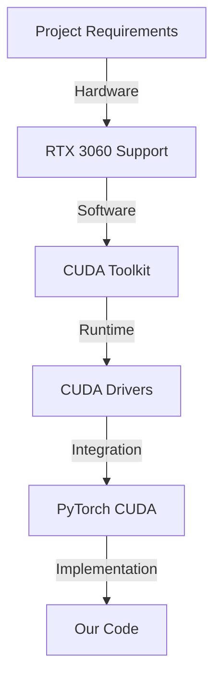

# 🔍 CDL6000 CUDA Dependency Analysis
*Status: CRITICAL | Priority: HIGH*

## 1. Project Requirements Analysis

### Hardware Specifications
```yaml
System:
  Hardware: Alienware x17 R2
  GPU: NVIDIA RTX 3060 
  VRAM: 6GB
```

### Core Processing Requirements
```yaml
Performance Metrics:
  Processing Time: <2s per document
  Memory Usage: <4.5GB
  GPU Utilization: <80%
  Batch Size: 32 documents
```

### Project Structure
```plaintext
CDL6000-project/
├── src/
│   ├── core/
│   │   ├── processor.py      # GPU processing required
│   │   └── metrics.py        # GPU monitoring required
├── docs/
│   └── obsidian-vault/
```

## 2. CUDA Dependency Chain 



## 3. Current System Status

### Hardware Check
✅ RTX 3060 Present
```bash
GPU: NVIDIA RTX 3060 (6GB VRAM)
Status: Available but not accessible
```

### Software Dependencies
```yaml
Status:
  CUDA Toolkit: ❌ Missing
  CUDA Drivers: ❌ Missing
  PyTorch CUDA: ❌ Not enabled
```

## 4. Critical Path Analysis

1. Missing CUDA Components:
   - CUDA Toolkit
   - NVIDIA Drivers 
   - PyTorch CUDA build

2. Performance Impact:
   ```yaml
   Without CUDA:
     - No GPU acceleration
     - Slower processing
     - Higher CPU load
   ```

## 5. Required Actions

### Immediate Steps (In Order)
1. Driver Installation:
   ```bash
   # Check current driver
   nvidia-smi
   ```

2. CUDA Toolkit:
   ```bash
   # Install CUDA 12.1 (for RTX 3060)
   # Download from NVIDIA site
   ```

3. PyTorch CUDA:
   ```bash
   # CUDA 12.1 build
   pip3 install torch torchvision torchaudio --index-url https://download.pytorch.org/whl/cu121
   ```

4. Environment Variables:
   ```bash
   # Add to system PATH
   CUDA_HOME=/usr/local/cuda-12.1
   PATH=$PATH:$CUDA_HOME/bin
   LD_LIBRARY_PATH=$LD_LIBRARY_PATH:$CUDA_HOME/lib64
   ```

### Validation Steps
```python
import torch
# Must return True
assert torch.cuda.is_available()
# Must show "cuda"
print(torch.cuda.get_device_name(0))
```

## 6. Implementation Impact

### Code Changes Required: None
Current code is CUDA-ready:
```python
self.gpu_available = torch.cuda.is_available()
```

### Performance Expectations
```yaml
With CUDA:
  Processing Time: ~0.5s/document
  GPU Memory: ~2GB
  GPU Util: 40-60%
```

## 7. Next Steps

1. Driver Installation
2. CUDA Toolkit Setup
3. PyTorch CUDA Build
4. Environment Configuration
5. Validation
6. Performance Testing

## ⚠️ CRITICAL NOTE
This is a **BLOCKING ISSUE**. The project cannot meet performance requirements without CUDA enablement.