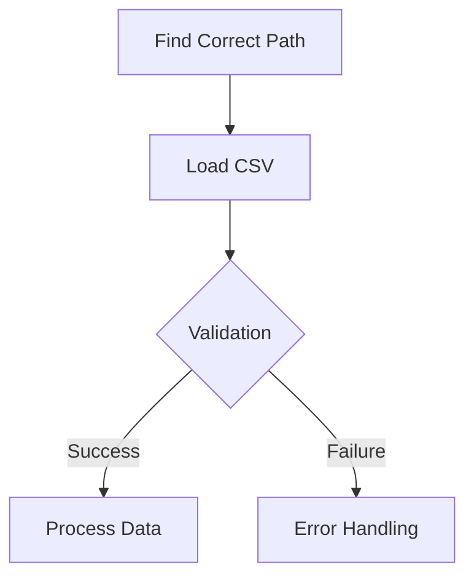

# 📊 Data Loading Process & Troubleshooting
*Date: 2024-11-14*

## 🔍 Problem Analysis

### Current Situation
```yaml
Project Structure:
  Location: CDL6000-project/
  Dataset: legal_text_classification.csv
  Path: data/raw/legal_text_classification.csv

Error Message:
  "No such file or directory: 'd:\\data\\raw\\legal_text_classification.csv'"

Issue:
  - Path construction incorrect
  - Absolute vs Relative path problem
```

### 🛠️ Διαδικασία Επίλυσης

#### 1. Path Analysis
```python
Current:
project_root = Path.cwd().parent  # Προβληματικό
data_path = project_root / "data" / "raw" / "legal_text_classification.csv"

Problem:
- cwd() μπορεί να δίνει λάθος directory
- parent μπορεί να πηγαίνει πολύ πίσω
```

#### 2. Βελτιωμένη Προσέγγιση
```python
# 1. Εύρεση του notebook directory
notebook_dir = Path(__file__).parent

# 2. Αναζήτηση του dataset σε σχετικά paths
possible_paths = [
    notebook_dir / "data/raw",
    notebook_dir.parent / "data/raw",
    notebook_dir / "../../data/raw"
]
```

## 📋 DataFrame Process

### 1. Loading Strategy


### 2. Data Validation
```yaml
Steps:
  1. Check file existence
  2. Validate columns
  3. Check data types
  4. Handle missing values

Metrics:
  - Record count
  - Column completeness
  - Data distribution
```

### 3. Best Practices
1. **Path Handling**
   - Use `Path` objects
   - Handle multiple possible locations
   - Verify file existence

2. **Data Loading**
   - Include error handling
   - Validate data structure
   - Report loading status

3. **Performance**
   - Monitor memory usage
   - Use efficient data types
   - Consider chunking for large files

## 🔄 Implementation Solution