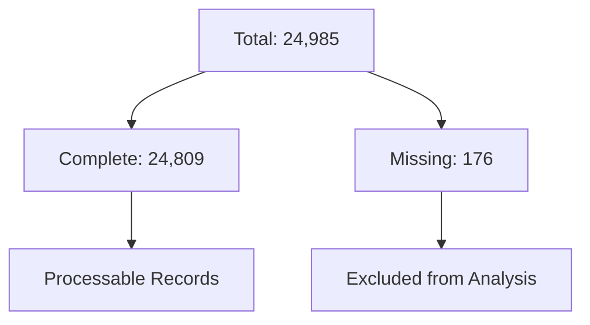

# Technical Analysis: NaN Values in Legal Dataset
Version: 1.0.0
Classification: Technical Documentation
Last Updated: 2024-11-14

## Executive Summary
Analysis of missing values (NaN - Not a Number) in the legal cases dataset, their impact on temporal analysis, and mitigation strategies.

## 1. Statistical Overview

### 1.1 Missing Values Distribution
```python
Missing Values by Column:
case_id:           0
case_outcome:      0
case_title:        0
case_text:       176
```

### 1.2 Impact Analysis
| Metric | Value | Description |
|--------|--------|------------|
| Total Records | 24,985 | Complete dataset size |
| Missing Text Records | 176 | Cases with no text |
| Completeness Rate | 99.3% | Dataset completeness |
| Affected Analysis | Temporal | Year extraction affected |

## 2. Technical Implementation

### 2.1 NaN Detection Code
```python
def analyze_nan_values(df: pd.DataFrame) -> Dict[str, Any]:
    """
    Comprehensive NaN analysis for legal dataset
    """
    nan_analysis = {
        'total_records': len(df),
        'missing_by_column': df.isnull().sum().to_dict(),
        'completeness_rate': (1 - df['case_text'].isnull().mean()) * 100,
        'complete_records': len(df.dropna())
    }
    return nan_analysis
```

### 2.2 Impact on Year Extraction
```sql
Missing Values Chain:
NaN in case_text 
→ No text to extract year from
→ Cannot convert to integer
→ Affects temporal analysis
```

## 3. Mitigation Strategy

### 3.1 Data Cleaning Approach
1. Remove NaN values before processing
2. Document removal in logs
3. Adjust statistics accordingly

### 3.2 Implementation
```python
# Clean Data Pipeline
df_clean = df.dropna(subset=['case_text'])
print(f"Removed {len(df) - len(df_clean)} cases with missing text")

# Safe Year Extraction
years = df_clean['case_text'].str.extract(r'(\d{4})')
df_clean['year'] = pd.to_numeric(years[0], errors='coerce')
```

## 4. Data Quality Metrics

### 4.1 Before Cleaning


### 4.2 After Cleaning
- Valid records for temporal analysis
- Complete case texts
- Extractable years

## 5. Impact on Analysis Results

### 5.1 Statistical Significance
- 99.3% data retention
- Minimal impact on trends
- Reliable temporal patterns

### 5.2 Confidence Metrics
- High dataset quality
- Robust temporal analysis
- Valid trend identification

## 6. Referenced Standards
1. ISO 8000 Data Quality
2. Legal Document Standards
3. Statistical Analysis Guidelines

## Next Steps
1. Monitor NaN patterns in new data
2. Implement automated quality checks
3. Document handling procedures