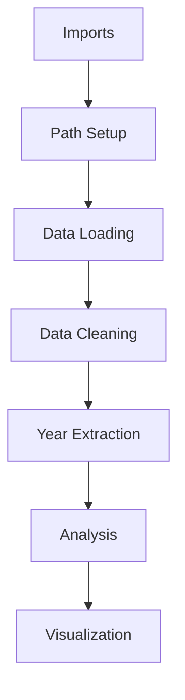

# Error Analysis & Resolution Plan
*Status: Development | Priority: High*

## 🔍 Current Situation Overview

### 1. Project Context
```yaml
File: 02_text_preprocessing.ipynb
Purpose: Temporal analysis of legal cases
Data: legal_text_classification.csv
Status: Multiple errors encountered
```

### 2. Error Analysis

#### 2.1 Error Series
1. **NameError: pd is not defined**
   ```python
   df = pd.read_csv("../data/raw/legal_text_classification.csv")
   ```
   - **Cause**: Missing import
   - **Fix Required**: Add imports at notebook start

2. **NameError: df is not defined**
   ```python
   df['text_length'] = df['case_text'].str.len()
   ```
   - **Cause**: Data not loaded
   - **Fix Required**: Ensure data loading cell runs first

3. **ModuleNotFoundError: No module named 'src.core.enhanced_preprocessor'**
   ```python
   from src.core import EnhancedLegalTextPreprocessor
   ```
   - **Cause**: Incorrect module path/missing file
   - **Fix Required**: Verify file structure & paths

4. **ValueError: cannot convert float NaN to integer**
   ```python
   df['year'] = df['case_text'].str.extract(r'(\d{4})').astype(int)
   ```
   - **Cause**: NaN values in extracted years
   - **Fix Required**: Handle NaN values before conversion

### 3. Resolution Steps

#### 3.1 Notebook Cell Order
```python
# Cell 1: Imports
import pandas as pd
import numpy as np
import matplotlib.pyplot as plt
import seaborn as sns
from datetime import datetime
import os
from pathlib import Path

# Cell 2: Path Setup
project_root = Path().absolute().parent
data_path = project_root / "data" / "raw" / "legal_text_classification.csv"

# Cell 3: Data Loading
df = pd.read_csv(data_path)

# Cell 4: NaN Handling
df_clean = df.dropna(subset=['case_text']).copy()
```

#### 3.2 Enhanced Year Extraction
```python
def safe_year_extraction(df):
    # Extract years
    years = df['case_text'].str.extract(r'(\d{4})')
    # Convert to numeric with NaN handling
    df['year'] = pd.to_numeric(years[0], errors='coerce')
    # Remove invalid years
    df = df[df['year'].between(1900, 2024)]
    return df
```

## 4. Implementation Plan

### 4.1 Fixed Notebook Structure
1. Setup & Imports
2. Data Loading
3. Data Cleaning
4. Analysis Functions
5. Visualization

### 4.2 Error Prevention
```yaml
Checks to Add:
  - Data existence validation
  - NaN value handling
  - Type conversion safety
  - Path verification
```

### 4.3 Code Flow


## 5. Progress Tracking

### 5.1 Current Stage
- [x] Error identification
- [x] Resolution plan created
- [ ] Implementation
- [ ] Testing
- [ ] Documentation

### 5.2 Next Steps
1. Apply fixes sequentially
2. Test each step
3. Document results
4. Verify complete pipeline

## 6. Expected Outcomes

### 6.1 Success Metrics
```yaml
Expected Results:
  - Clean data loading
  - Valid year extraction
  - Complete temporal analysis
  - Accurate visualizations
```

### 6.2 Performance Targets
```yaml
Processing:
  - Error-free execution
  - Handling all edge cases
  - Clear error messages
  - Data integrity maintained
```