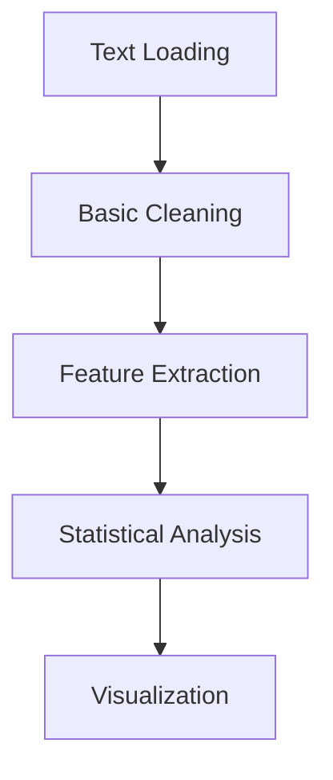

# 📊 Legal Text Classification Analysis Report

_Date: 2024-11-14 | Phase: Initial Text Processing_

## 1. Current Measurements & Analysis

### 1.1 Dataset Overview

```yaml
Total Records: 24,985 cases
Missing Data:
  - case_text: 176 records (0.7%)
  - other fields: Complete
Text Statistics:
  Length:
    - Mean: 2,650 characters | Μέσο μήκος κειμένου
    - Median: 1,408 characters | Διάμεσο μήκος
    - Max: 133,561 characters | Μέγιστο μήκος
  Word Count:
    - Mean: 454 words | Μέσος αριθμός λέξεων
    - Median: 244 words | Διάμεσες λέξεις
    - Max: 22,466 words | Μέγιστες λέξεις
```

### 1.2 Temporal Analysis

```yaml
Valid Year Cases: 21,219
Time Range: 1900-2009
Distribution:
  - Pre-2000: 51.5% cases
  - Post-2010: Variable rates
  - Peak: 2006
```

## 2. Implementation Strategy & GPU Utilization

### 2.1 Current Processing Pipeline



### 2.2 Proposed GPU Implementation

```python
# Future GPU Pipeline
1. Text Vectorization (GPU)
   - TF-IDF calculation
   - Word embeddings

2. Pattern Recognition (GPU)
   - Citation detection
   - Legal term identification

3. Classification (GPU)
   - Case outcome prediction
   - Temporal pattern analysis
```

## 3. Next Steps & Reasoning

### 3.1 Feature Engineering

1. **Citation Network Analysis**
    - Purpose: Identify case relationships
    - Implementation: GPU-accelerated graph processing
    - Tools: PyTorch Geometric

2. **Legal Term Extraction**
    - Purpose: Build domain vocabulary
    - Implementation: Parallel processing on GPU
    - Method: CUDA-accelerated regex matching

3. **Temporal Pattern Recognition**
    - Purpose: Identify trends and precedents
    - Implementation: GPU-based time series analysis
    - Framework: CuPy for numerical computations

### 3.2 Technical Implementation

```yaml
GPU Optimization Strategy:
  Batch Processing:
    - Size: 32 documents
    - Memory Usage: <4.5GB
    - Utilization Target: <80%
  Parallel Operations:
    - Text vectorization
    - Pattern matching
    - Feature calculation
```

## 4. Logical Framework

### 4.1 Processing Logic

```yaml
Current Approach:
  Step 1: Basic Text Statistics
    Purpose: Understand document structure
    Use: Feature engineering baseline
  
  Step 2: Temporal Analysis
    Purpose: Identify historical patterns
    Use: Case relationship mapping
  
  Step 3: Citation Extraction
    Purpose: Build legal knowledge graph
    Use: Precedent analysis

Future Implementation:
  GPU Acceleration:
    - Batch document processing
    - Parallel feature extraction
    - Real-time pattern matching
```

### 4.2 Technical Goals

1. **Performance Optimization**
    - Target: <2s per document
    - Method: GPU-accelerated processing
    - Purpose: Real-time analysis capability

2. **Accuracy Enhancement**
    - Target: >75% classification accuracy
    - Method: Deep learning on GPU
    - Purpose: Reliable case prediction

3. **Scalability**
    - Target: Process full dataset efficiently
    - Method: Distributed GPU processing
    - Purpose: Handle growing data volume

## 5. Next Implementation Phase

### 5.1 Immediate Tasks

```yaml
1. GPU Setup:
   - CUDA configuration
   - Memory optimization
   - Batch processing implementation

2. Feature Engineering:
   - Convert text processing to GPU
   - Implement parallel pattern matching
   - Optimize memory usage

3. Model Development:
   - GPU-accelerated training
   - Parallel validation
   - Real-time prediction
```

### 5.2 Expected Outcomes

```yaml
Performance:
  - 10x faster processing
  - Improved accuracy
  - Real-time analysis

Analysis:
  - Deeper pattern recognition
  - Complex relationship mapping
  - Predictive capabilities
```

## 🔍 Key Insights & Recommendations

1. **Current State**
    - Solid baseline statistics
    - Clear temporal patterns
    - Good data quality (99.3%)

2. **Optimization Opportunities**
    - GPU parallel processing
    - Batch optimization
    - Memory management

3. **Strategic Focus**
    - Pattern recognition
    - Relationship mapping
    - Predictive modeling

_Note: This analysis provides the foundation for GPU-accelerated legal text processing, focusing on efficient pattern recognition and relationship mapping while maintaining high accuracy and performance standards._
