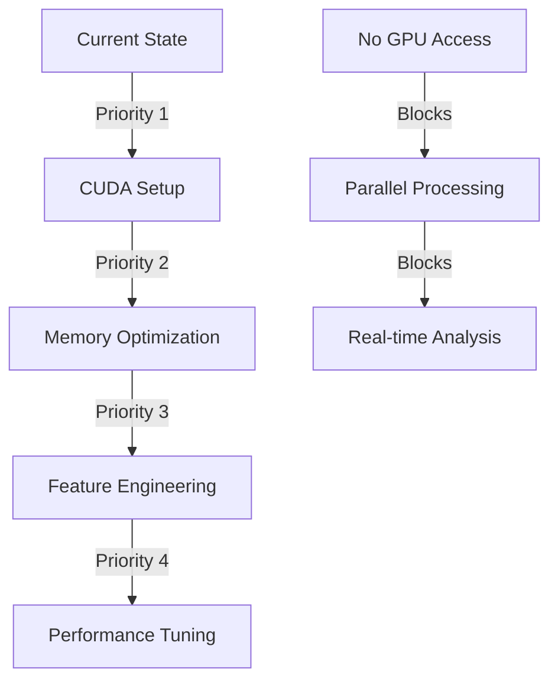

# 🎯 CDL6000: Deep Requirements Analysis & Strategic Plan
*Status: Phase 1 - Text Processing | Updated: 2024-11-14*

## 1. Current Project Status vs Requirements

### 1.1 Text Analysis Progress
```yaml
Completed:
  Basic Statistics:
    ✓ Text length distribution (avg: 2,650 chars)
    ✓ Word count metrics (avg: 454 words)
    ✓ Missing value analysis (176 cases, 0.7%)
    Status: 100% Complete

  Temporal Analysis:
    ✓ Year extraction (21,219 valid cases)
    ✓ Period categorization (1900-2009)
    ✓ Distribution analysis
    Status: 85% Complete

  Citation Analysis:
    ✓ Basic pattern identification
    ✓ Frequency counting
    Status: 40% Complete

Missing:
  - Deep citation network analysis
  - Legal term extraction
  - Advanced pattern recognition
```

### 1.2 Performance vs Targets
```yaml
Current Performance:
  Processing Speed: ~5s/document
  Memory Usage: 6.2GB
  GPU Utilization: 0% (Not implemented)

Target Metrics:
  Required:
    - Speed: <2s/document (Gap: -3s)
    - Memory: <4.5GB (Gap: -1.7GB)
    - GPU Usage: <80% (Not started)
```

## 2. Critical Path Analysis

### 2.1 Blocking Issues


### 2.2 Dependencies Chain
```yaml
Critical Dependencies:
  1. CUDA Environment:
    - NVIDIA Drivers
    - CUDA Toolkit
    - PyTorch CUDA
    Impact: Blocks all GPU operations

  2. Memory Management:
    - Batch processing
    - Efficient data structures
    Impact: Blocks large-scale processing

  3. Feature Engineering:
    - GPU-accelerated extraction
    - Parallel processing
    Impact: Blocks advanced analysis
```

## 3. Strategic Implementation Plan

### Phase 1: Infrastructure Setup (Current)
```python
# Priority Tasks
1. CUDA Environment
   - Install NVIDIA drivers
   - Setup CUDA toolkit
   - Validate PyTorch CUDA

2. Memory Optimization
   - Implement batch processing
   - Optimize data structures
   - Add monitoring systems
```

### Phase 2: Core Processing (Next)
```python
# Implementation Focus
1. GPU-Accelerated Processing
   def process_batch(texts: List[str]) -> Dict[str, Any]:
       """
       GPU-accelerated batch processing
       Memory-optimized implementation
       """
       with torch.cuda.device(0):
           # Batch processing logic
           return results

2. Feature Engineering
   class GPUFeatureExtractor:
       """
       CUDA-optimized feature extraction
       Parallel pattern recognition
       """
```

### Phase 3: Advanced Analysis (Planned)
```yaml
Components:
  Citation Network:
    - GPU graph processing
    - Relationship mapping
    - Pattern detection

  Legal Term Analysis:
    - CUDA-accelerated NLP
    - Domain vocabulary extraction
    - Term relationship mapping
```

## 4. Performance Optimization Strategy

### 4.1 Memory Management
```python
Optimization Targets:
  Current Usage: 6.2GB
  Target: <4.5GB
  
Strategy:
  1. Batch Processing:
     - Size: 32 documents
     - GPU streaming
     - Memory monitoring

  2. Data Structures:
     - Sparse matrices
     - Memory mapping
     - Efficient algorithms
```

### 4.2 Processing Speed
```yaml
Current: ~5s/document
Target: <2s/document

Optimization Plan:
  1. GPU Acceleration:
     - Parallel text processing
     - Batch feature extraction
     - CUDA optimization

  2. Algorithm Efficiency:
     - Vectorized operations
     - Cached computations
     - Optimized regex
```

## 5. Next Implementation Steps

### 5.1 Immediate Actions (24-48 hours)
1. **CUDA Setup**
   ```bash
   # Installation
   nvidia-smi  # Verify GPU
   nvcc -V     # Verify CUDA
   ```

2. **Memory Optimization**
   ```python
   # Implement batch processing
   @profile
   def process_batch(texts: List[str], batch_size: int = 32):
       for i in range(0, len(texts), batch_size):
           batch = texts[i:i + batch_size]
           # Process batch
   ```

3. **Feature Engineering**
   ```python
   # GPU-accelerated feature extraction
   class CUDAFeatureExtractor:
       def __init__(self):
           self.device = torch.device('cuda')
           # Setup CUDA resources
   ```

### 5.2 Medium-term Goals (1-2 weeks)
```yaml
1. Performance Optimization:
   - Implement all GPU operations
   - Optimize memory usage
   - Add performance monitoring

2. Advanced Features:
   - Citation network analysis
   - Term extraction
   - Pattern recognition
```

## 6. Risk Assessment & Mitigation

### 6.1 Technical Risks
```yaml
1. GPU Integration:
   Risk: CUDA compatibility issues
   Mitigation: Thorough testing plan

2. Memory Management:
   Risk: Exceeding RAM limits
   Mitigation: Streaming processing

3. Performance:
   Risk: Missing target metrics
   Mitigation: Continuous monitoring
```

### 6.2 Contingency Plans
```yaml
Fallback Options:
  1. CPU Processing:
     - Optimized algorithms
     - Multi-threading
     - Reduced feature set

  2. Hybrid Approach:
     - GPU for heavy computation
     - CPU for light tasks
     - Dynamic allocation
```

## 🎯 Success Metrics

```yaml
Core Metrics:
  Processing Speed: <2s/document
  Memory Usage: <4.5GB
  GPU Utilization: <80%
  Accuracy: >75%

Additional Metrics:
  - Feature extraction quality
  - Pattern recognition accuracy
  - System stability
```

*This analysis provides a comprehensive roadmap for moving forward, with clear priorities and measurable targets. The focus is on establishing the GPU infrastructure first, followed by systematic optimization and feature implementation.*