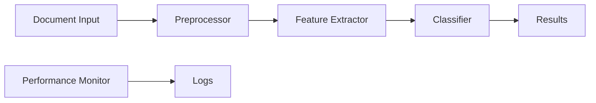

# CDL6000 System Design Document

## 1. System Architecture

### 1.1 Processing Pipeline


### 1.2 Core Components
```python
# Document Processor
class LegalDocumentProcessor:
    - preprocess_text()
    - extract_features()
    - validate_document()

# Classifier
class SVMClassifier:
    - train()
    - predict()
    - evaluate()

# Performance Monitor
class PerformanceMonitor:
    - track_metrics()
    - log_performance()
    - generate_report()
```

## 2. Data Flow

### 2.1 Input Processing
1. Document validation
2. Text normalization
3. Feature extraction
4. Vector generation

### 2.2 Classification Flow
1. Model prediction
2. Confidence calculation
3. Result validation
4. Performance logging

## 3. Technology Stack

### 3.1 Core Technologies
- Python 3.8.12
- scikit-learn 0.24.2
- spaCy 3.1.0
- PyTorch 1.9.0

### 3.2 Development Tools
- VS Code
- Git/GitHub
- Obsidian
- pytest

## 4. Implementation Details

### 4.1 Text Processing
```python
def preprocess_text(text: str) -> Dict:
    """
    1. Clean text
    2. Extract entities
    3. Generate features
    """
    return processed_features

def extract_features(doc: Document) -> Array:
    """
    1. TF-IDF vectorization
    2. Entity features
    3. Custom legal features
    """
    return feature_vector
```

### 4.2 Model Architecture
```python
class Classifier:
    def __init__(self):
        self.vectorizer = TfidfVectorizer()
        self.model = LinearSVC()
        
    def train(self, X, y):
        """Train classifier with memory optimization"""
        
    def predict(self, X):
        """Generate predictions with confidence scores"""
```

## 5. Performance Optimization

### 5.1 Memory Management
- Batch processing
- GPU memory monitoring
- Resource cleanup

### 5.2 Processing Optimization
- Parallel processing
- Caching strategies
- Dynamic batching

## 6. Monitoring & Logging

### 6.1 Metrics Collection
```python
metrics = {
    'processing_time': [],
    'memory_usage': [],
    'classification_accuracy': [],
    'gpu_utilization': []
}
```

### 6.2 Logging Strategy
- Real-time performance tracking
- Daily metric summaries
- Error logging and alerts

## 7. Testing Strategy

### 7.1 Unit Tests
- Component validation
- Feature extraction
- Classification accuracy

### 7.2 Integration Tests
- Pipeline validation
- Performance verification
- Resource management

## 8. Security Considerations

### 8.1 Data Protection
- Input validation
- Error handling
- Access control

### 8.2 Error Management
- Graceful degradation
- Recovery procedures
- Error logging