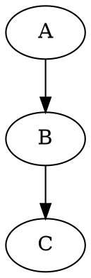

# 📚 Professional Markdown Style Guides
*Version 1.0.0 | Last Updated: 2024-11-14*

## 🎯 Style Categories

### 1️⃣ Technical-Legal Style (TLS-001)
*For formal documentation, legal analysis, and technical specifications*

```markdown
# Document Title [ISO-Standard/Reference]
Version: 1.0.0
Classification: Confidential/Public
Last Updated: YYYY-MM-DD

## Executive Summary
[Concise overview of content]

## Technical Specifications
### 1. Component Overview
1.1. Architecture
1.2. Implementation

### 2. Legal Compliance
2.1. Regulatory Framework
2.2. Compliance Requirements

## Analysis
| Parameter | Value | Standard |
|-----------|--------|-----------|
| Item 1 | Value 1 | ISO-9001 |
| Item 2 | Value 2 | ISO-27001 |

## References
[1] ISO Standard Reference
[2] Legal Framework Citation
```

### 2️⃣ Development-Operations Style (DOS-001)
*For guides, logs, and operational documentation*

```markdown
# 🔧 Operation Guide: [Component Name]
*Status: Active | Priority: High*

## 🎯 Quick Reference
> Essential information and commands

### 🚀 Setup Steps
1. First step
   ```bash
   command --flag value
   ```
2. Second step
   - Sub-item A
   - Sub-item B

### ⚠️ Common Issues
| Issue | Solution | Priority |
|-------|----------|-----------|
| Error 1 | Fix 1 | High |
| Error 2 | Fix 2 | Medium |

### 📋 Checklist
- [ ] Task 1
- [ ] Task 2
- [x] Completed task

### 📊 Status Dashboard

```

### 3️⃣ Research-Notes Style (RNS-001)
*For research notes, daily logs, and informal documentation*

```markdown
---
type: research-note
date: YYYY-MM-DD
tags: [category, topic, subtopic]
status: in-progress
---

# 📝 Research Note: [Topic]

## 💡 Key Insights
- Main point 1
  - Supporting detail
  - Evidence
- Main point 2

## 🔍 Observations
> Important quotes or findings

## 🎯 Action Items
1. [ ] Priority task
2. [ ] Secondary task

## 🔗 Related Notes
- [[linked-note-1]]
- [[linked-note-2]]

## 📊 Quick Stats
- Metric 1: value
- Metric 2: value
```

## 🎨 Style Usage Guidelines

### 📋 Document Type Matrix

| Style | Use Cases | Emoji Usage | Formatting |
|-------|-----------|-------------|------------|
| TLS-001 | Legal docs, Technical specs | Minimal/None | Strict hierarchy |
| DOS-001 | Guides, Operations | Moderate | Flexible |
| RNS-001 | Notes, Research | Liberal | Free-form |

### 🎯 Style Selection Criteria

1. **TLS-001 When:**
   - Creating formal documentation
   - Writing legal analysis
   - Developing specifications
   - Drafting compliance documents

2. **DOS-001 When:**
   - Writing operational guides
   - Creating tutorials
   - Documenting procedures
   - Maintaining logs

3. **RNS-001 When:**
   - Taking research notes
   - Writing daily logs
   - Brainstorming
   - Creating personal references

### 📱 Style Components

#### Headers
```markdown
# TLS-001: Level 1
## 1. Level 2
### 1.1. Level 3

# 🚀 DOS-001: Level 1
## 🔧 Level 2
### 📌 Level 3

# 📝 RNS-001: Level 1
## 💡 Level 2
### 🔍 Level 3
```

#### Lists
```markdown
# TLS-001
1. First item
   1.1. Sub-item
   1.2. Sub-item

# DOS-001
- 🔵 Main point
  - 📌 Sub-point
  - 📎 Sub-point

# RNS-001
- 💡 Idea
  - 🔍 Detail
  - 📊 Evidence
```

#### Code Blocks
````markdown
# TLS-001
```python
# Standard code block
def function():
    pass
```

# DOS-001
```bash
# Command with annotation
command --flag value  # Explanation
```

# RNS-001
```text
Quick notes or observations
```
````

## 📋 Implementation Guidelines

1. **File Naming:**
   ```
   YYYY-MM-DD-category-title.md
   ```

2. **Front Matter:**
   ```yaml
   ---
   type: [tls|dos|rns]
   date: YYYY-MM-DD
   version: 1.0.0
   status: [draft|review|final]
   ---
   ```

3. **Link Structure:**
   ```markdown
   [[category/subcategory/document-name|Display Text]]
   ```

## 🔄 Version Control Practices

### Commit Messages
```bash
# TLS-001
docs(legal): add compliance documentation

# DOS-001
docs(guide): update setup instructions 🔧

# RNS-001
docs(notes): add research findings 📝
```

### Branch Naming
```bash
# TLS-001
docs/legal-compliance-update

# DOS-001
docs/setup-guide-revision

# RNS-001
notes/research-findings
```

## 💡 Tips

1. **Consistency is Key**
   - Stick to chosen style
   - Use consistent emoji sets
   - Maintain hierarchy

2. **Navigation**
   - Use clear headers
   - Implement links
   - Maintain index files

3. **Maintenance**
   - Regular updates
   - Version control
   - Documentation review

---

*💡 Pro Tip: Create templates for each style in Obsidian for quick access*