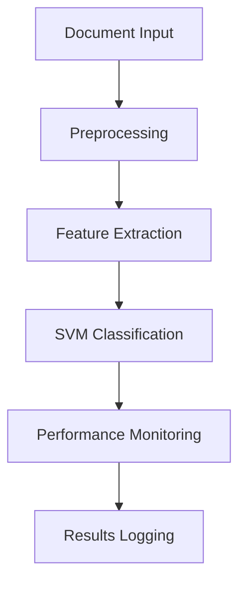

# CDL6000 Legal Document Classification System Proposal
Date: 2024-11-14
Status: Initial Draft
Path: /docs/obsidian-vault/01-specs/proposal.md

## 1. Research Question

### Primary Question
"How can we optimize SVM-based legal document classification to achieve >75% accuracy while maintaining sub-2-second processing time per document on consumer GPU hardware?"

### Sub-Questions
1. What is the optimal balance between processing speed and classification accuracy?
2. How can we effectively utilize GPU resources (RTX 3060) without exceeding 80% memory usage?
3. What preprocessing techniques are most effective for legal document classification?

## 2. Technical Objectives

### 2.1 Performance Targets
```yaml
Processing:
  Time: <2s per document
  Memory: <4.5GB RAM
  GPU: <80% utilization (RTX 3060 6GB)

Accuracy:
  Classification: >75%
  F1 Score: >0.74
  Precision: >0.75
  Recall: >0.75
```

### 2.2 Implementation Goals
1. Efficient document preprocessing pipeline
2. GPU-optimized SVM implementation
3. Real-time performance monitoring
4. Automated logging and versioning

## 3. Methodology

### 3.1 Dataset Analysis
- Kaggle Legal Text Classification Dataset
- 25,000 legal documents
- Features: case_id, case_outcome, case_text
- Balanced classification distribution

### 3.2 Technical Approach


### 3.3 Development Strategy
1. Implement base processing pipeline
2. Optimize for GPU performance
3. Add monitoring and logging
4. Conduct performance testing
5. Iterate based on results

## 4. Implementation Plan

### 4.1 Core Components
```python
src/
├── core/           # Processing pipeline
├── ml/            # Classification logic
└── utils/         # Support functions
```

### 4.2 Documentation Structure
```bash
docs/obsidian-vault/
├── 00-overview/   # Project overview
├── 01-specs/      # Technical specs
├── 02-design/     # Architecture
└── daily/         # Progress logs
```

## 5. Evaluation Framework

### 5.1 Performance Metrics
1. Processing time per document
2. Memory utilization
3. GPU usage patterns
4. Classification accuracy
5. F1 score, precision, recall

### 5.2 Testing Strategy
```yaml
Unit Tests:
  - Component validation
  - Performance checks
  - Resource monitoring

Integration Tests:
  - Pipeline verification
  - System stability
  - Resource management
```

## 6. Development Timeline

### Week 1-2: Foundation
- [x] Project setup and documentation
- [ ] Basic pipeline implementation
- [ ] Initial GPU integration

### Week 3-4: Core Development
- [ ] SVM implementation
- [ ] Performance optimization
- [ ] Monitoring system

### Week 5-6: Refinement
- [ ] Testing and validation
- [ ] Performance tuning
- [ ] Documentation completion

## 7. Risk Assessment

### Technical Risks
1. GPU memory constraints
2. Processing time optimization
3. Classification accuracy targets

### Mitigation Strategies
1. Batch processing implementation
2. Dynamic resource allocation
3. Iterative optimization approach

## 8. Success Criteria

### 8.1 Technical Achievement
- Meet all performance targets
- Achieve accuracy goals
- Maintain resource limits

### 8.2 Documentation Quality
- Complete technical documentation
- Detailed progress logs
- Clear experimental results

## 9. References
1. Kaggle Legal Text Classification Dataset
2. SVM for Legal Document Classification (Papers)
3. GPU Optimization Techniques
4. Performance Monitoring Best Practices

## Version Control
Repository: github.com/alexliak/CDL6000
Branch Strategy: main (stable) / develop (active)