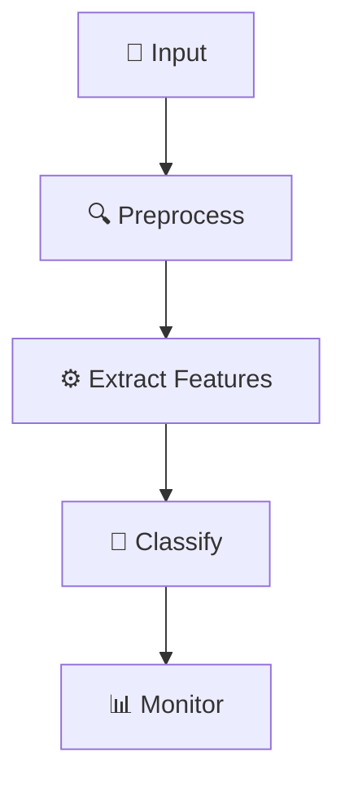

# 🚀 CLD6000: Legal Document Classification System
*Status: Development | Priority: High*

## 🎯 Quick Reference
> SVM-based classification system optimized for RTX 3060 GPU

### 🔧 System Requirements
- NVIDIA RTX 3060 (6GB VRAM)
- 16GB RAM minimum
- 500GB SSD Storage

### 📊 Performance Targets
```yaml
Processing:
  ⏱️ Time: <2s per document
  💾 Memory: <4.5GB RAM
  🎮 GPU: <80% utilization
Accuracy:
  🎯 Classification: >75%
  📈 F1 Score: >0.74
```

## 🚀 Implementation Steps

### 1️⃣ Setup Environment
```bash
# Create virtual environment
python -m venv cld6000-env

# Install dependencies
pip install -r requirements.txt

# Verify GPU setup
python -c "import torch; print(torch.cuda.is_available())"
```

### 2️⃣ Development Pipeline


### ⚠️ Common Issues & Solutions
| Issue | Solution | Priority |
|-------|----------|----------|
| GPU OOM | Implement batch processing | High |
| Slow Processing | Optimize preprocessing | Medium |
| Low Accuracy | Fine-tune SVM params | High |

### 📋 Implementation Checklist
- [x] Project setup
- [ ] Pipeline implementation
- [ ] GPU optimization
- [ ] Testing framework
- [ ] Documentation

## 🔍 Testing & Monitoring

### Performance Tests
```python
# Quick performance check
def test_performance():
    doc = load_test_document()
    start_time = time.time()
    result = classifier.process(doc)
    process_time = time.time() - start_time
    assert process_time < 2.0
```

### 📊 Resource Monitoring
```yaml
Monitoring:
  - GPU Usage
  - Processing Time
  - Memory Utilization
  - Classification Accuracy
```

## 🛠️ Development Tools
- VSCode with Python/CUDA extensions
- Git for version control
- Docker for containerization
- PyTest for testing

## 📝 Daily Tasks
1. [ ] Code review
2. [ ] Performance testing
3. [ ] Documentation update
4. [ ] GPU optimization

## 🔗 Important Links
- [Project Repository](github.com/alexliak/CDL6000)
- [Documentation](docs/index.md)
- [Issue Tracker](issues/)

## 💡 Pro Tips
- Use batch processing for large documents
- Monitor GPU memory constantly
- Regular performance benchmarking
- Keep detailed progress logs

---

*📅 Last Updated: 2024-11-14 | 👤 Team: ML Engineering*